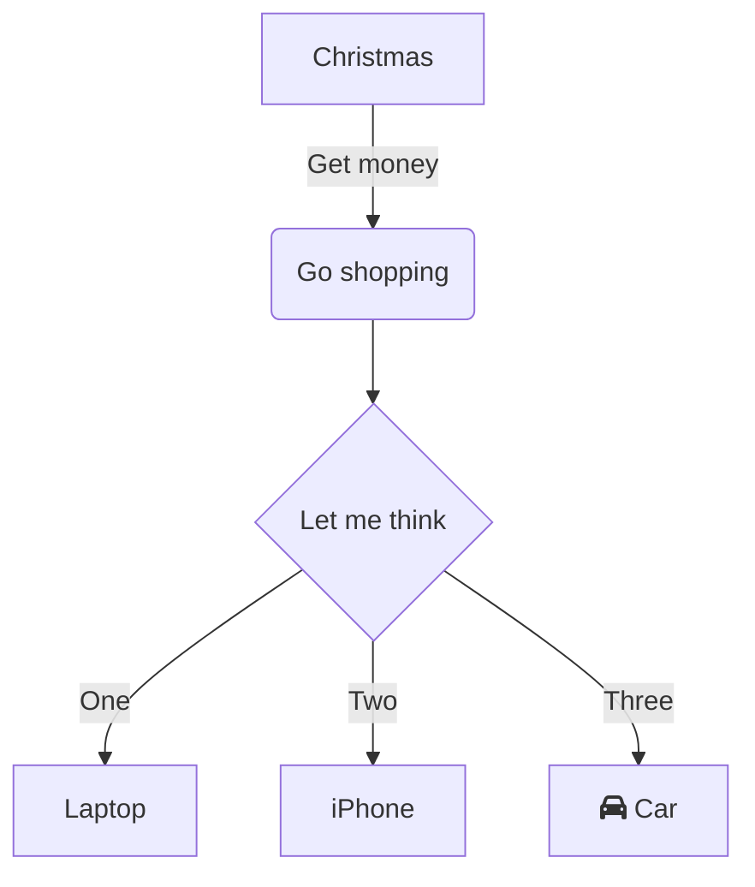

# bestMove App

This App is intended as analysis tool to enable an household to identify the best place to move to

This is an MVP including the following features:
- Load of a list of houses into the app
- Insertion of APIary access key
- research and print of isochrone areas with various options
- filtering houses on hose characteristics and by isochronous

## Example 1

## Example 2

## TO Add

 

